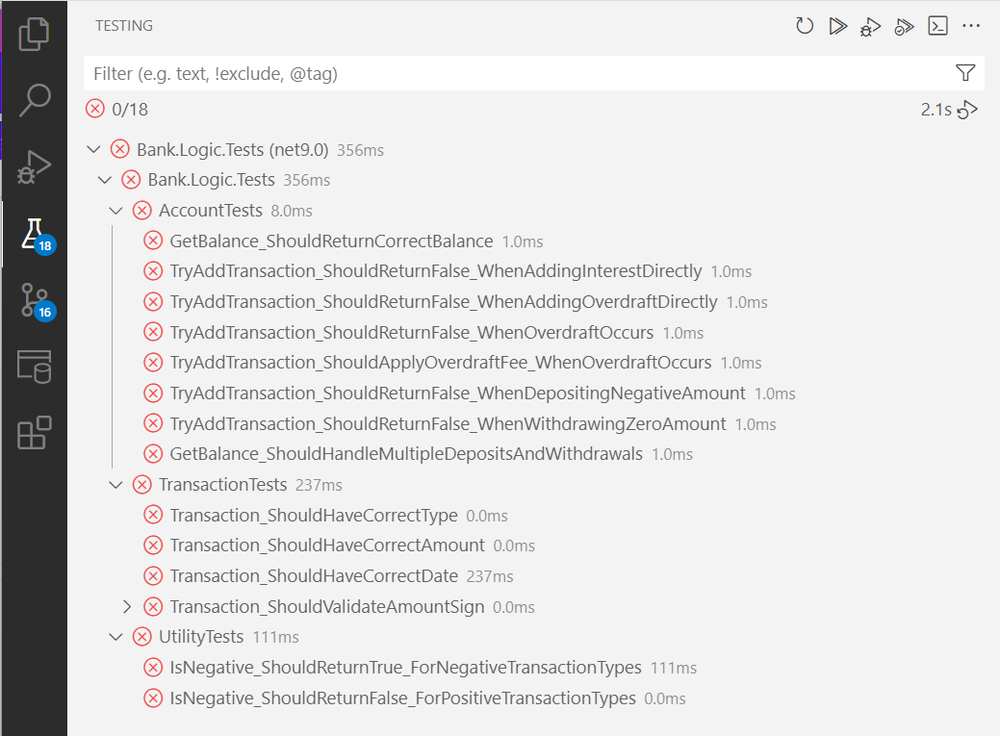

# Assignment Week 09

*Worth pointing out that this assignment, because I was a day late providing it to you, is due a day later (Monday).*

There is no UI for this project, only getting all tests to pass.

## Universal Acceptance Criteria

This represents acceptance criteria that is true irrespective of assignment criteria.

1. You **must understand** every single line of your solution.
2. Your code **must compile and run** without errors.
3. You **must turn in your repository URL** in Brightspace.

## Assignment Acceptance Criteria

This represents acceptance criteria necessary for assignment completion.

### Implement `Account.cs`
Continue beyond this list to satisfy all unit test.

1. **GetBalance()**: Returns the total balance by summing all transaction amounts. Hint: You can use LINQ’s built-in `.Sum()` method to sum the `Amount` property of all transactions in the internal transactions list.  

1. **GetTransactions()**: Returns a read-only list of all transactions. Hint: You can use the `.AsReadOnly()` method on your internal list to return a read-only version. This requires the `System.Collections.ObjectModel` namespace.  

1. **TryAddTransaction(ITransaction transaction)**: The return value indicates whether the transaction was actually added to the internal list. If a withdrawal results in an overdraft (`Balance() < 0`), an automatic `Fee_Overdraft` transaction should be added. Transactions with the type `Unknown` should always be rejected by returning false. 

### Implement `Transaction.cs`

1. **Amount**: Represents the monetary value of the transaction. If the transaction type returns `true` from `Utilities.InidicatesNegativeAmount()`, the amount must be negative, otherwise, it must be positive. If the amount does not match the expected postive/negative sign, throw an `ArgumentOutOfRangeException`.  

## Bonus Acceptance Criteria

Create the **ManagementFee** feature.

**Update Bank.Logic with:**
1. Add `AccountSettings.ManagementFee`: a public double  property.  
1. Change `Transaction.Amount`: Ensure `ManagementFee` is negative.  
1. Change `Account.TryAddTransaction()`: Allow `ManagementFee` transactions.  
1. Change `Utilities.InidicatesNegativeAmount()`: `ManagementFee` is `true`.  

**Update `TransactionTests.cs` with:**
1. CreateTransaction_WithManagementFee_ShouldSetCorrectType();
1. CreateTransaction_WithPositiveManagementFee_ShouldThrowException();
1. CreateTransaction_WithNegativeManagementFee_ShouldBeValid();

**Update `AccountTests.cs` with:**
1. TryAddTransaction_WhenAddingManagementFee_ShouldReturnTrue();
1. GetBalance_WithManagementFeeDeduction_ShouldReturnCorrectTotal();

## Instructions

Welcome to the **Banking Project**! We will continue this for several weeks. 

### You have 2 projects

1. **`Bank.Logic` (Class Library)**
2. **`Bank.Logic.Tests` (Unit Tests)**

Your **primary task** is to implement the missing logic inside `Bank.Logic`. You will know you are **done** when **all unit tests pass** successfully.   

### **Final Reminder**
1. You **must** pass **all unit tests** for your implementation to be correct.  
1. Focus on **validating input**, **handling overdrafts**, and **ensuring correct balance calculations**.  
1. If a test **fails**, **read the test message** and adjust your implementation.  

Good luck, and happy coding! 🚀

